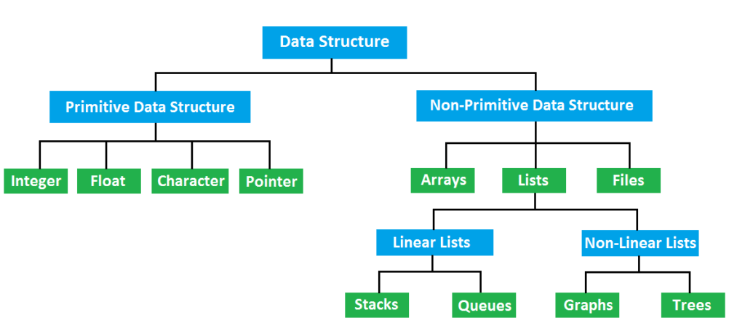

# Data Structures


Las estructuras de datos las podemos clasificar en:




## Primitivas
- Entero (```int```): Representan los números enteros, también pueden utilizarse para prepresentar variables lógicas (`true`/`false`) también conocidos como *booleanos*.
- Punto flotante (```float```): se utilizan para representar numeros "reales" de precisión finita.
- Caracter (```char```): Representan letras y símbolos. 
- Puntero (```pointer```): Son tipos de datos especiales que indican la ubicación en memoria de algun valor almacenado.


## No-Primitivas:

### Arrays
También conocido como *vectores*, es una secuencia de números de longitud finita, 

```c
a = [4,5,4,2,1,3,-1,..., ]
```
se almacenan en memoria en celdas consecutivas, lo que los hace fácil de llamar, ya que solo se necesita la memory adress del primer elemento (`a[0]`).

<div class="memoria">

| mem.   |  valor |      |
| ------ | ------ | ---- |
| ...    |        |      |
| `1000` |   4    | a[0] |
| `1001` |   5    | a[1] |
| `1002` |   4    | a[2] |
| `1003` |   2    | a[3] |
| `1004` |   1    | a[4] |
| `1005` |   3    | a[5] |
| `1006` |  -1    | a[6] |
| `1007` |        |      |
| `1008` |        |      |
| `1009` |        |      |
| `1010` |        |      |
| ...    |        |      |

</div>

Los *strings* son un tipo de arrays pero con letras y terminan en un valor `null` que indica el final del string.
```c
char saludo[5]='Hola!'
``` 

| mem.   |  valor |
| ------ | ------ |
| ...    |        |
| `1000` |  'H'   |
| `1001` |  'o'   |
| `1002` |  'l'   |
| `1003` |  'a'   |
| `1004` |  '!'   |
| `1005` | `null` |
| `1006` |        |
| `1007` |        |
| `1008` |        |
| `1009` |        |
| `1010` |        |
| ...    |        |

Las *matrices* se almacenan de forma similar, pero se necesitan más indices para representarlos:
```c 		
m = [ [2,3], [-1,0], [6,9] ]
	
```

| mem.   |  valor  |
| ------ | ------- |
| ...    |         |
| `1000` | m[0][0] |
| `1001` | m[0][1] |
| `1002` | m[1][0] |
| `1003` | m[1][1] |
| `1004` | m[2][0] |
| `1005` | m[2][1] |
| `1006` |         |
| `1007` |         |
| `1008` |         |
| `1009` |         |
| `1010` |         |
| ...    |         |

Una demostración del comportamiento de arrays en C puede encontarse en	[`./arrays.c`](./arrays.c)


### Listas

Las listas, ya sean lineales o no lineales se valen del uso de **nodos**, que  son estructuras que poseen un valor y uno (ó más) pointers, estos últimos apuntan a la memory address de algún otro elemento.

```c
struct node
{
    int  val;
    struct node *next;
};
```

#### Lineales (*linked lists*)
Son estructuras de datos que permiten almacenar muchos nodos, lo hace teniendo a cada nodo apuntando al siguiente. Ver [`./likedList.c`](./linkedList.c)

<div class="memoria">
<table >
<tbody>
   <tr><th> addr.</th><th> valor  </th><th>  nodo </th></tr>
   <tr><td>...   </td><td>        </td><td>       </td></tr>
   <tr><td> 1000 </td><td> 7      </td><td> N1    </td></tr>
   <tr><td> 1001 </td><td> 1008   </td><td> N1(p) </td></tr>
   <tr><td> 1002 </td><td> 14     </td><td> N3    </td></tr>
   <tr><td> 1003 </td><td> 1000   </td><td> N3(p) </td></tr>
   <tr><td> 1004 </td><td> na     </td><td>       </td></tr>
   <tr><td> 1005 </td><td> na     </td><td>       </td></tr>
   <tr><td> 1006 </td><td> na     </td><td>       </td></tr>
   <tr><td> 1007 </td><td> na     </td><td>       </td></tr>
   <tr><td> 1008 </td><td> 112    </td><td> N2    </td></tr>
   <tr><td> 1009 </td><td> 1002   </td><td> N2(p) </td></tr>
   <tr><td> 1010 </td><td> empty  </td><td>       </td></tr>
   <tr><td>...   </td><td>        </td><td>       </td></tr>
</tbody>
</table>
</div>

En este ejemplo la lista es *circular*,pero puede ser modificado terminando en un nodo *nulo*.

Una ventaja de esto es que es  fácil realocar un nodo nuevo entre dos nodos preexistentes, ya que solo involucra modificar el pointer de el nodo previo al nuevo nodo. También pueden ser facilmente reordenadas, fragmentadas, invertidas, entre otras cosas.

Dos tipos importantes de *linkedlists* son:
  + Queues: Son *linkedlists* donde la incorporación/remoción de nodos sigue el sistema *First-In First-Out* (FIFO) [`./queue.c`](./queue.c).
  + Stacks: Son *linkedlists* donde la incorporación/remoción de nodos sigue el sistema *Last-In Firt-Out* (LIFO) [`./stack.c`](./stack.c).

Las operaciones de agregar y sacar nodos de las listas se conocen como `push` y `pop` respectivamente.


#### No lineales
Si extendemos la estructura de *nodo* permitiendo que posea más de un pointer (ó *child*) podemos crear otras estructuras más complejas como *arboles* y *grafos*

  + Arboles (*trees*)
	Es una estructura compuesto por nodos que tienen almenos dos pointers ó "hijos". En el caso particular que sean exactamente 2 pointers se los conoce como *arboles binarios*. Ver implementación en C [`./tree.c`](./tree.c) ).
```c
struct node
{
    int  val;
    struct node *nextLeft;
    struct node *nextRight;
};
```

  + Grafos
	Son estructuras en la que los nodos apuntan unos a otros de forma arbitraria.
	[`./graph.c`](./graph.c)


### Otras estructuras:
#### Heaps
 Son estructuras de tipo arbol que satisface la siguiente propiedad: para cada nodo h, si p es su nodo padre padre, entonces el valor de p es mayor ó igual al de h. [`./heap.c`](./heap.c)


